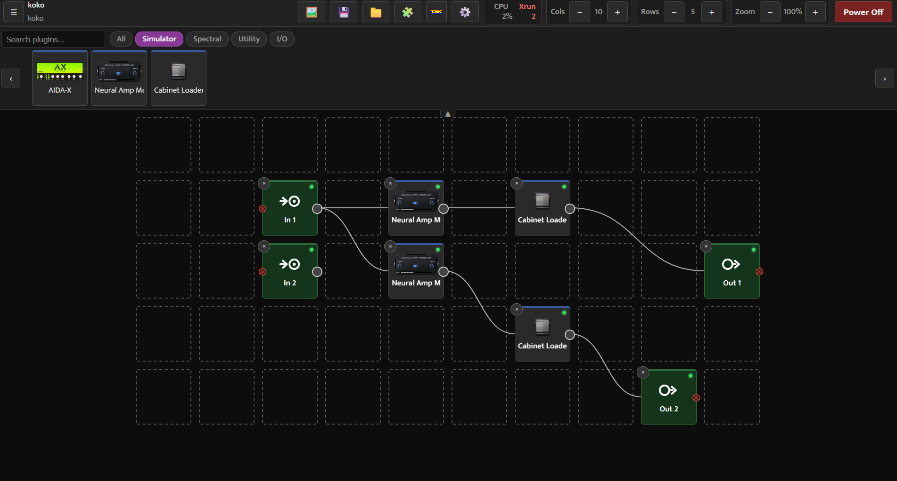
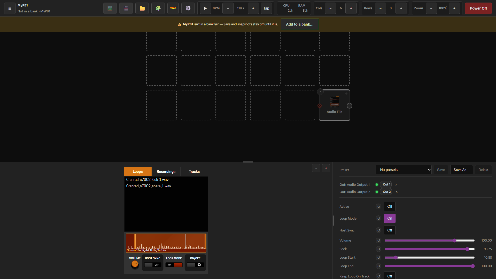
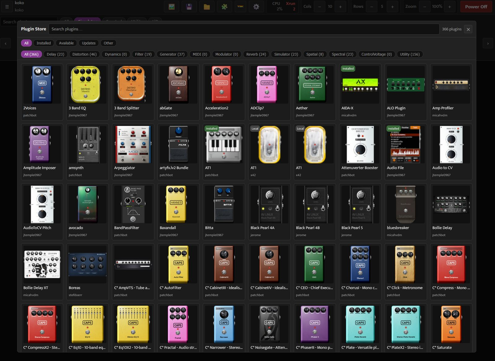
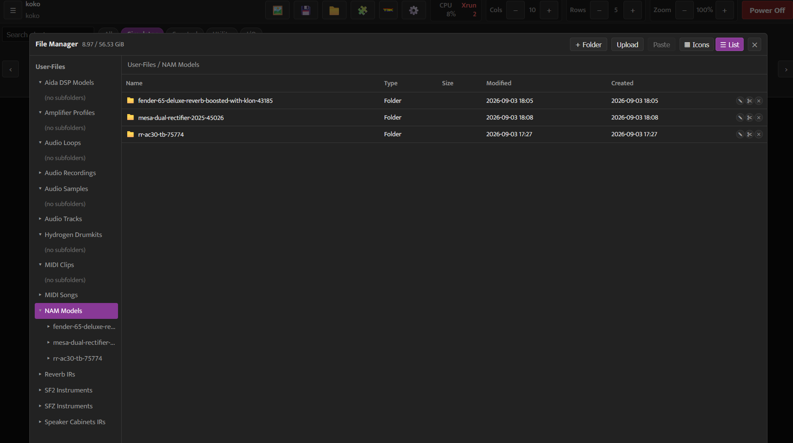
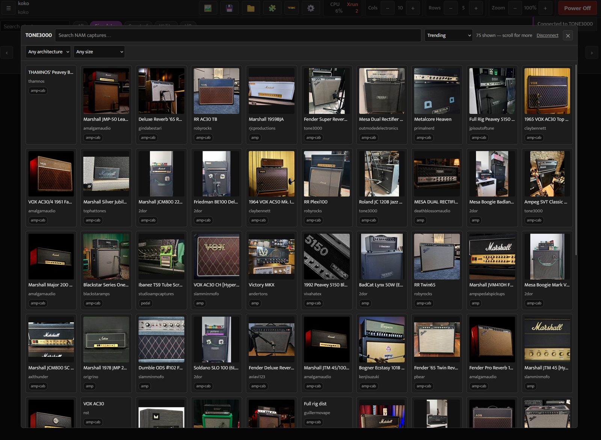

mod-ui
======

This is the UI for the MOD software. It's a webserver that delivers an HTML5 interface and communicates with mod-host.
It also communicates with the MOD hardware, but does not depend on it to run.

The ``rpi4-pisound-integration`` branch combines current MOD Audio updates with
selected MODEP features for Raspberry Pi 4, Pisound and 64-bit Patchbox OS,
while retaining the Grid theme. Follow the `paired UI/host build and deployment
guide <docs/rpi4-pisound-integration.rst>`_ for that system. The
`upstream audit <docs/upstream-branch-audit.rst>`_ records the source selections.

Install
-------

There are instructions for installing in a 64-bit Debian based Linux environment.
It will work in x86, other Linux distributions and Mac, but you might need to adjust the instructions.

The following packages will be required::

    $ sudo apt-get install virtualenv python3-pip python3-dev git build-essential libasound2-dev libjack-jackd2-dev liblilv-dev libjpeg-dev zlib1g-dev

NOTE: libjack-jackd2-dev can be replaced by libjack-dev if you are using JACK1; libjpeg-dev is needed for python-pillow, at least on my system.

Start by cloning the repository::

    $ git clone --branch rpi4-pisound-integration https://github.com/danmigdev/mod-ui.git
    $ cd mod-ui

Create a python virtualenv::

    $ virtualenv modui-env
    $ source modui-env/bin/activate

Install python requirements::

    $ pip3 install -r requirements.txt

Compile libmod_utils::

    $ make -C utils

Run
---

Before running the server, you need to activate your virtualenv
(if you have just done that during installation, you can skip this step, but you'll need to do this again when you open a new shell)::

    $ source modui-env/bin/activate

mod-ui depends on mod-host and the JACK server running in order to make sound. So after you have JACK setup and running, in another terminal do::

    $ mod-host -n -p 5555 -f 5556

If you do not have mod-host, you can tell mod-ui to fake the connection to the audio backend.
You will not get any audio, but you will be able to load plugins, make connections, save pedalboards and all that. For this, run::

    $ export MOD_DEV_HOST=1

And now you are ready to start the webserver::

    $ export MOD_DEV_ENVIRONMENT=0
    $ python3 ./server.py

Setting the environment variables is needed when developing on a PC.
Open your browser and point to http://localhost:8888/.

Themes
------

mod-ui ships two independent front-end themes, both served by the same backend:

- **Default** (``/`` or ``/index.html``): the original free-canvas pedalboard editor, with each
  plugin drawn at its own custom skin size and connected with hand-dragged cables.
- **Grid** (``/grid.html``): a newer, Fractal Audio FM3-Edit-style editor, with plugins as
  uniform blocks in a configurable row/column grid and parameters edited in a bottom panel.
  It supports manual audio connections and parallel signal paths. Placing a new block
  next to another can connect matching ports automatically; moving an existing block keeps
  its connections. When port counts differ during manual wiring, a dialog lets you choose
  the connections; adjacent placement leaves those ports unconnected.

Each theme has a link to switch to the other: the grid icon in the default theme's top menu bar,
and "Classic UI" under Settings in the grid theme.

Click a plugin block to open its editor at the bottom: the plugin's own graphical interface
on the left and generic controls on the right. Both views edit the same plugin. The panel
includes presets, audio-port connections, an Active switch, parameter reset buttons, and
file selectors for plugins that use audio files, impulse responses or models. Drag the panel
edges to resize it; the plugin skin has independent zoom controls.

Banks, snapshots and device controls
~~~~~~~~~~~~~~~~~~~~~~~~~~~~~~~~~~~~

- **Banks / Pedalboards / Snapshots:** the top-left menu opens the navigation tree. An open
  pedalboard that is not in a bank remains visible, with an **Add to a bank** action. Add it
  to a bank to enable Save and snapshot creation.
- **Transport:** play/stop, BPM adjustment and tap tempo are in the toolbar. Settings adds
  beats-per-bar and tempo synchronization (internal, MIDI clock slave or Ableton Link).
- **Meters:** CPU and RAM usage are shown in the toolbar, along with xruns when reported.
- **Settings:** text size is independent of grid zoom. Audio buffer sizes range from 8 to
  1024 frames in powers of two, subject to the audio driver's support. The MIDI devices
  dialog selects devices and offers aggregated mode and MIDI Loopback when available.

The Grid theme still lacks some features of the default theme: CV-port management,
control-chain device management, cloud bank/preset sharing, the tuner and the update check.

Plugin store and files
~~~~~~~~~~~~~~~~~~~~~~

The grid theme has its own plugin store (Patchstorage) and an Explorer-style file manager,
both built in its own visual style:

Patchstorage browsing and installation work without a registered MOD device.
The backend selects binaries for the running userspace ABI and records each
installed bundle's store revision. The store shows updates and partially
installed bundles; local plugins remain accessible when the catalog is offline.
``MOD_PATCHSTORAGE_*`` configuration also accepts MODEP's ``PATCHSTORAGE_*``
environment names. For this target the public platform is ``8046`` and the
ARM64 target is ``8280``. Plugin presets can use a separate writable directory
through ``MOD_PRESETS_DIR``.

Installing this branch on a device
----------------------------------

This branch includes MOD Audio ``master`` at ``eebb9c73``, the Grid theme,
TONE3000, the file manager, and selected MODEP compatibility features.
It also carries a reviewed mod-host patch series, with source pins and native
build scripts in ``scripts/rpi4-pisound/``.

**Raspberry Pi 4 / Pisound / Patchbox OS 64-bit.** Use the
`integration guide <docs/rpi4-pisound-integration.rst>`_. It builds the paired
UI and host beside the packaged programs and activates them with reversible
MODEP service overrides. Rebuild the native library with this Python wrapper.

**Other source installations.** Follow *Install* and *Run* above, with a compatible
mod-host and JACK server. Grid is available at ``/grid.html``.

**On a device that runs mod-ui as a distro package** (Blokas' ``modep-mod-ui``, sealed MOD
images), the older ``scripts/deploy-tone3000/`` workflow patches UI features in
place. It does not install the paired host or the complete Raspberry integration.
Its command, from a machine that can SSH to the device, is::

    $ scripts/deploy-tone3000/deploy.sh --host user@device --key t3k_pub_xxxxxxxx

That run installs the TONE3000 integration and patches the backend for Grid:

- the **grid template route** — ``grid()`` in ``webserver.py`` so an installed
  ``grid.html`` renders;
- the **grid file manager** backend — the ``/filesvc`` proxy and ``/filesvc-stat`` handlers
  ``html/js/grid-file-manager.js`` needs (never committed upstream);
- the **raw bank-list endpoint** used by grid navigation and the **8-1024-frame buffer-size
  route and validation** used by Settings;
- the **TONE3000** integration — see the section below for the key.

Grid frontend assets (``grid.html``, all ``grid-*.js`` and the Grid stylesheets) are
refreshed only if ``grid.html`` already exists on the device and ``--no-grid`` is not set.
The script does not install the Grid frontend on a device that has never had it; use a
source checkout or your own image for a complete installation.

Every file it changes is backed up to ``<file>.pre-tone3000``; it syntax-checks the Python,
HTTP-checks the restarted service, and rolls everything back if the service does not come up.
``deploy.sh --host user@device --rollback`` undoes it. See
``scripts/deploy-tone3000/README.md`` for the details, ``--dry-run``, and running it directly
on the device.

The deploy script does not update ``modgui.js``. On a packaged installation without this
branch's file-list refresh changes, reload the page to see newly downloaded models in a
plugin that was already open.

Not covered by the script: a few independent ``webserver.py`` bug-fixes this branch also
carries (snapshot/bank save guards, ``poweroff``) and ``polkit/49-mod-ui-power.rules`` (so
Power Off / Reboot work headless — ``setup.py`` installs it on a source build). Port those
from ``git diff master...grid-theme`` if you want them, or run from source.

TONE3000
--------

The **Tone3000** entry in the top menu lets the user browse the TONE3000 catalog and download
a capture straight into the Neural Amp Modeler. The tone is signed for on TONE3000 in a popup
(OAuth PKCE), each ``.nam`` model is saved under *NAM Models* in the File Manager, and the new
files jump to the top of every NAM plugin's model list. The NAM LV2 plugin itself is not
involved and needs no change.

**Setup (once per deployment).** The publishable key is deployment configuration and is never
committed, so it has to be supplied where mod-ui runs:

1. Sign in at tone3000.com -> **Settings -> API Keys -> Create API Key** and copy the
   ``t3k_pub_...`` publishable key.
2. Leave that key's **allowed redirect URIs empty**. Per TONE3000's docs only registered
   redirect URIs are enforced, so with none registered the feature works on any device address
   with no per-device configuration; the PKCE verifier and the ``state`` check are what protect
   the flow. (Register specific URIs only to lock it down, and expect to update them whenever an
   address changes -- e.g. DHCP on the device.)
3. Give the key to mod-ui, either way:

   - environment: ``MOD_TONE3000_CLIENT_ID=t3k_pub_...`` (for a systemd service, a drop-in
     such as ``/etc/systemd/system/<unit>.d/tone3000.conf`` with ``[Service]`` +
     ``Environment=MOD_TONE3000_CLIENT_ID=...``);
   - or a file: write the key into ``<data dir>/tone3000-client-id`` (the path
     ``MOD_TONE3000_CLIENT_ID_FILE`` overrides). This survives package upgrades and needs no
     unit edit.

   ``MOD_TONE3000_API`` overrides the API base (default ``https://www.tone3000.com``).

Without a key the Tone3000 tab shows a "not set up on this deployment" note instead of the
browse button.

**For the end user** there is nothing to configure: open mod-ui, click **Tone3000**, click
**Open TONE3000**, sign in once, pick a tone.

In the Grid theme the catalogue is browsed right in the panel — search, filter by neural
architecture and model size, then download whole tones or individual captures:

Tests
-----

Frontend
~~~~~~~~

The JavaScript suite uses Node's built-in test runner and jsdom. From the repository root::

    $ npm ci
    $ npm test

Use ``npm run test:watch`` while developing. These tests exercise frontend logic and DOM
interactions without JACK or a running mod-ui server; browser layout and device integration
still need manual checks. See ``test/js/README.md`` for the test harness and scope.

Backend
~~~~~~~

The test suite in ``test/`` contains HTTP-level characterization tests (pytest + tornado's testing tools).
They run against a faked audio backend, so no JACK, mod-host or MOD hardware is needed.

First complete the Install section above (virtualenv, python requirements and ``make -C utils`` — the tests
import the webserver, which requires ``utils/libmod_utils.so``).

On Python 3.10 or newer, the pinned tornado 4.3 needs a one-time patch (see the note in ``requirements.txt``)::

    $ sed -i 's/collections.MutableMapping/collections.abc.MutableMapping/' modui-env/lib/python3.*/site-packages/tornado/httputil.py

Install the test requirements and run the suite from the repository root::

    $ source modui-env/bin/activate
    $ pip3 install -r test-requirements.txt
    $ pytest

NOTE: ``test/hmi-protocol-integrationtest.py`` is not part of this suite — it is a standalone integration
test for the HMI serial protocol that requires JACK, mod-host and a serial device, and pytest does not
collect it.
