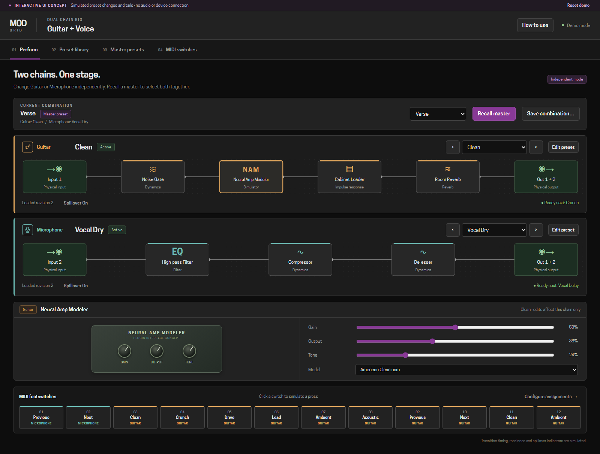
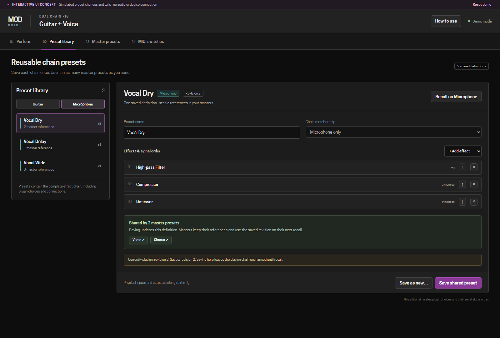
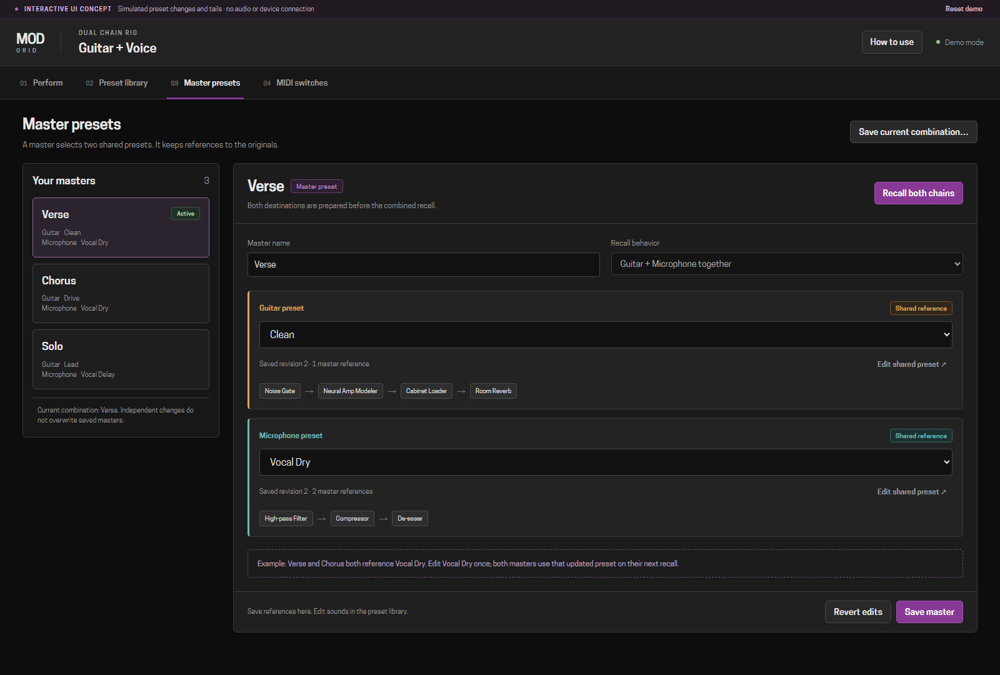
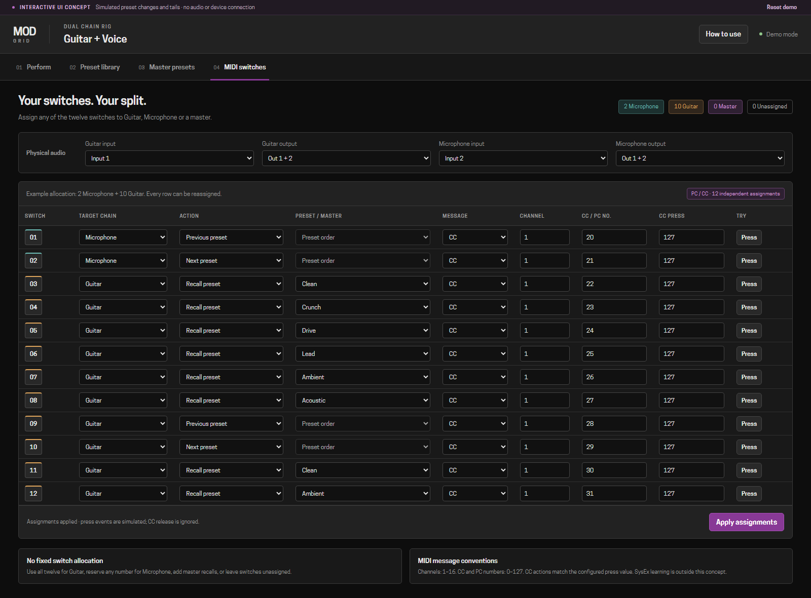
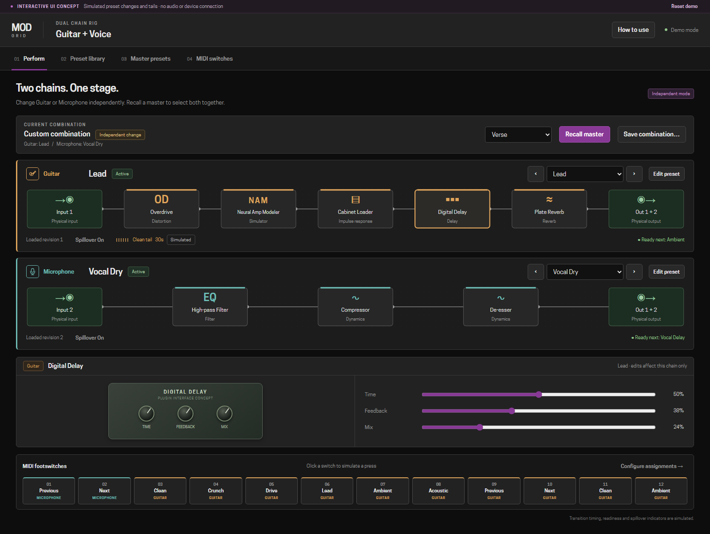

Independent chains: interactive UI mockups
==========================================

Open ``index.html`` directly in a browser. No installation or build is required.
The prototype runs independently of mod-ui and does not contact a device, process
audio or receive MIDI. All interface text is English.

Alternatively, serve the repository root::

    python -m http.server 8766 --bind 127.0.0.1

Then visit http://127.0.0.1:8766/docs/mockups/dual-chain/.

Workflow
--------

1. **Perform:** select a preset or press Previous/Next on either chain. Only that
   chain changes. Click a plugin to open its parameter editor. The twelve buttons
   at the bottom simulate MIDI switch presses.
2. **Preset library:** choose Guitar or Microphone, edit a shared preset's name
   or effect order, add/remove effects, and save it. References in master presets
   continue to point to that definition. Currently playing copies retain their
   loaded revision until recalled. ``Save as new`` creates a separate definition.
3. **Master presets:** choose one Guitar and one Microphone reference. Saving
   records their IDs. ``Recall both chains`` simulates preparing both destinations
   before changing the current combination.
4. **MIDI switches:** assign every row to Guitar, Microphone, Master or Unassigned.
   Choose previous/next or a direct preset/master, then configure PC/CC, channel,
   message number and CC press value. ``Apply assignments`` validates duplicates
   and MIDI ranges. ``Press`` simulates an applied mapping.

Try changing switch 3 to Microphone and switches 11/12 to Master: the allocation
becomes 3 Microphone, 7 Guitar and 2 Master. Any allocation is allowed.

Changing a chain independently or editing its live parameters produces a Custom
combination. Saved masters remain unchanged. Save or recall edited chain state
before saving a combination so the master can reference saved definitions.

Demo edits are saved in this browser's local storage where available. ``Reset
demo`` restores the initial examples. ``How to use`` opens a short walkthrough.

Screenshots
-----------

Scope
-----

Transition delays, readiness and tail countdowns are visual simulations. They
are not measurements or guarantees of audio performance. The preset editor
demonstrates serial effect order; arbitrary graph wiring and audio/MIDI engines
belong to the implementation described in ``../../dual-chain-presets.rst``.

The spillover example can be opened with ``?view=perform&scenario=spillover``.
Each view is linkable with ``?view=perform``, ``?view=library``, ``?view=masters``
or ``?view=switches``.
